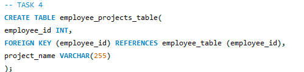
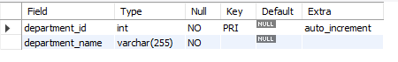
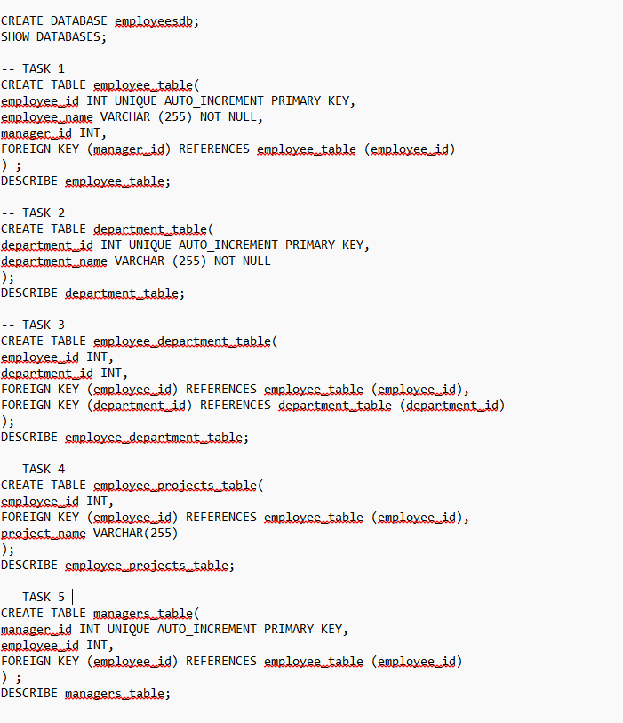

## Finals Task 1. Multi Level Company Database
For this task, we are given MySQL statements that need to be implemented.
Here’s the screenshot of Query Statements (See screenshots)

Here's the screenshot of Table Structure (See screenshots)

- Task 1

- Task 2

- Task 3

- Task 4

- Task 5

Here's the ER Diagram or Relational Schema

SQL copy of the database and table structures

