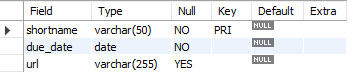

## Finals Lab Task 2. Transforming ER Model to Relational Tables
For this task, we are given an ER diagram representing student assignment submissions, which we need to convert into MySQL tables.
Here’s the screenshot of Query Statements (See screenshots)

Here's the screenshot of Table Structure (See screenshots)

Here's the ER Diagram or Relational Schema

SQL copy of the database and table structures
