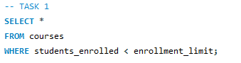
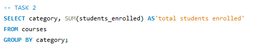
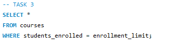
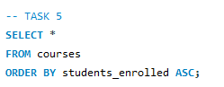
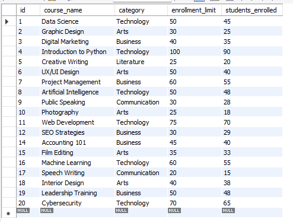
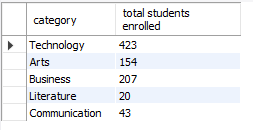
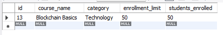
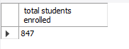
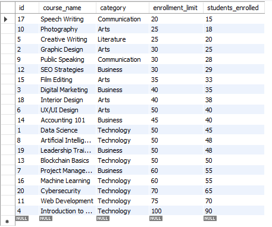
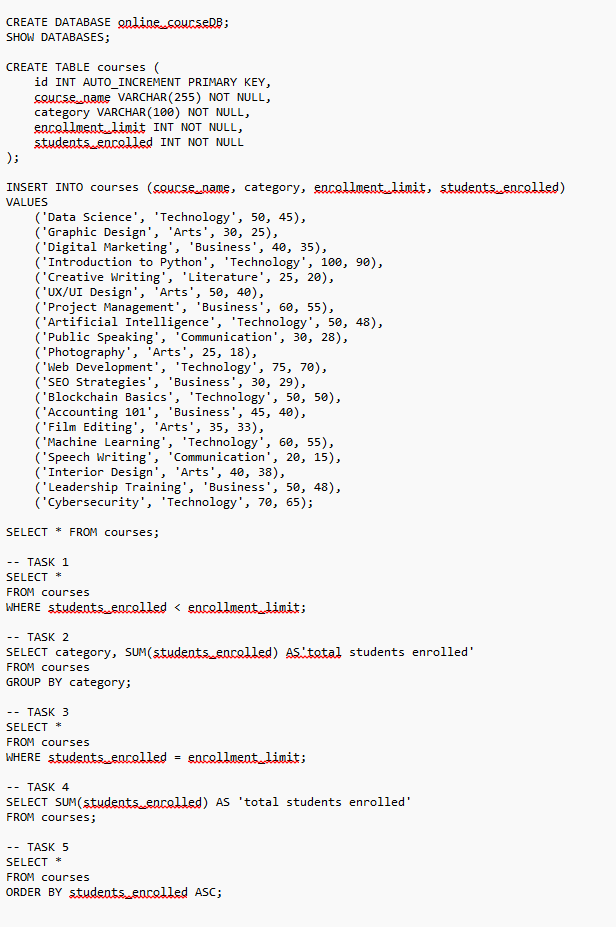

## Finals Lab Task 4. Using SELECT CLAUSE
For this task, we need to implement using MySQL statements.

Here’s the screenshot of Query Statements (See screenshots)

- Task 1
  

- Task 2
  

- Task 3

- Task 4
  

- Task 5
  

Here's the screenshot of Table Structure (See screenshots)

- Task 1
  

- Task 2
  

- Task 3
  

- Task 4
  

- Task 5
  

SQL copy of the database and table structures

