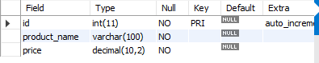
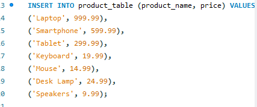
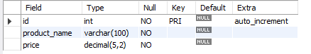
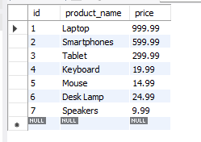
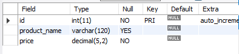
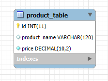
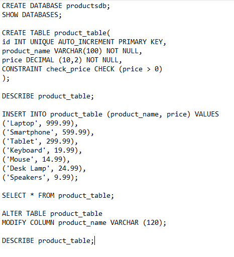

## Finals Lab Task 3. Table Manipulation
For this task, we need to implement MySQL statements. 

Here’s the screenshot of Query Statements (See screenshots)

- Task 1: Create a table named products with the following fields:

- Task 2: Add a CHECK constraint

- Task 3: Insert the products into the products table.

- Task 4: Modify the product_name field into a maximum length of 120 characters. (Altering Table)
  

Here's the screenshot of Table Structure (See screenshots)
- Table 1

- Table 2

- Table 3

Here's the ER Diagram or Relational Schema

SQL copy of the database and table structures

