## Finals Lab Task 6. MongoDB Practice

## Create Database

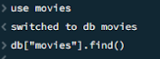

Insert Documents

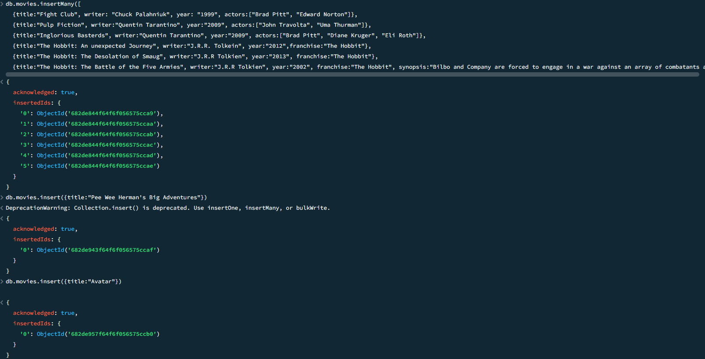

## Query / Find Documents

- Task 1
  
db.movies.find()

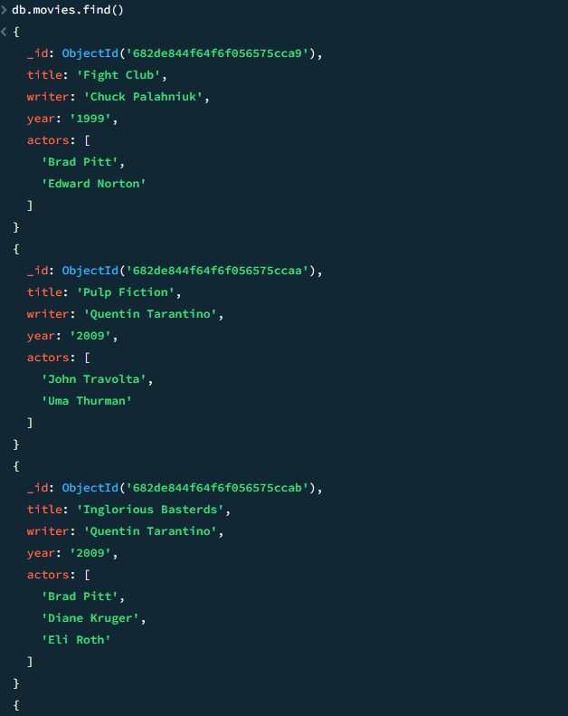

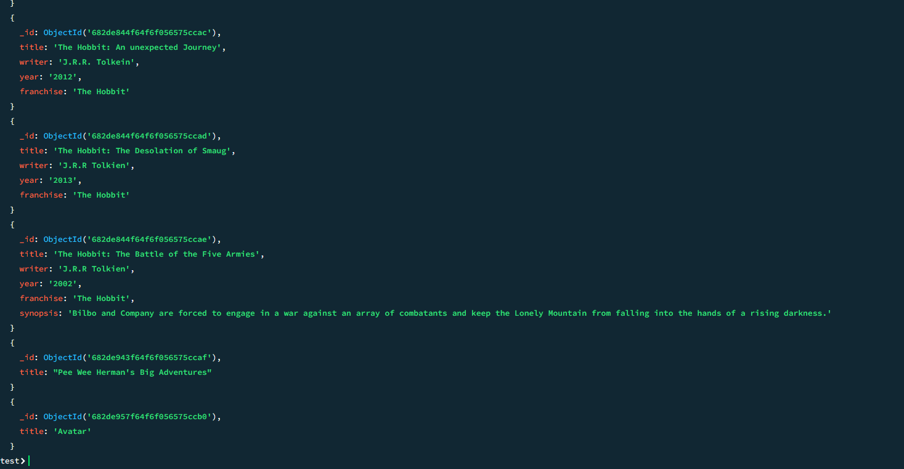

- Task 2
  
db.movies.find({writer:"Quentin Tarantino"})

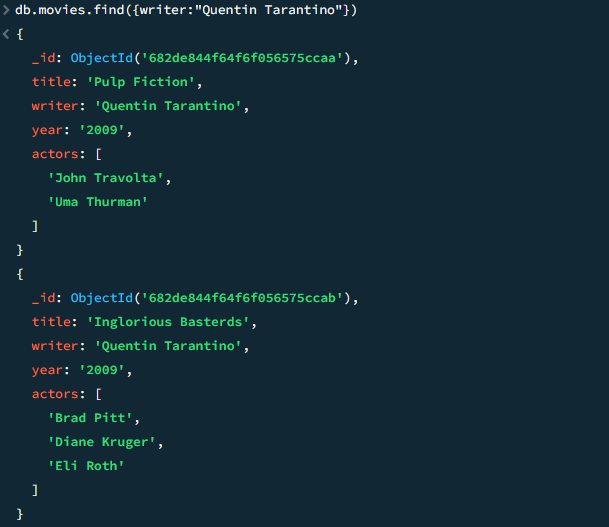

- Task 3
  
db.movies.find({actors:"Brad Pitt"})

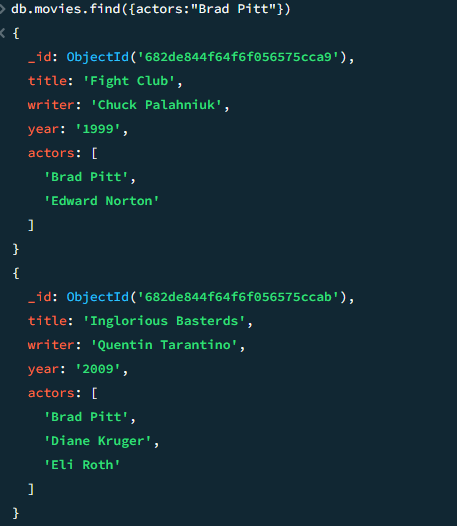

- Task 4
  
db.movies.find({franchise:"The Hobbit"})

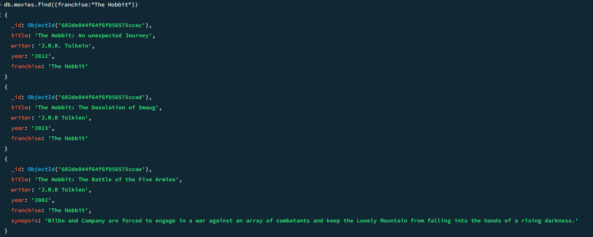

- Task 5
  
db.movies.find({year:{$gt:"1990", $lt:"2000"}})

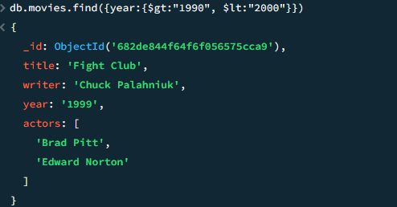

- Task 6
  
db.movies.find({$or:[{year:{$gt:"2010"}},{year: {$lt:"2000"}}]})

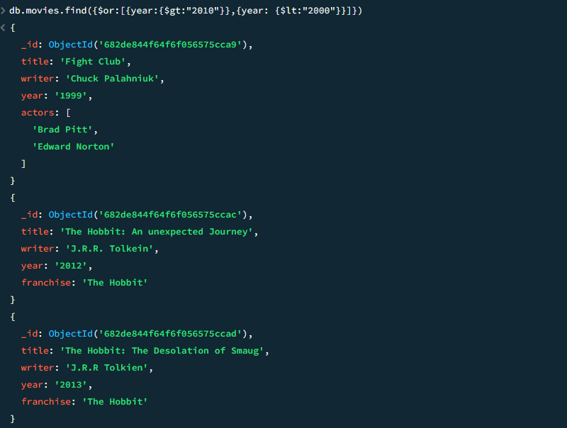

## Update Documents
  
db.movies.update({_id:ObjectId("5c9f98e5e5c2dfe9b3729bfe")}, {$set:{synopsis:"A reluctant hobbit, Bilbo Baggins, sets out to the Lonely Mountain with a spirited group of dwarves to reclaim their mountain home - and the gold within it - from the dragon Smaug."}})

db.movies.update({_id:ObjectId("5c9fa42ae5c2dfe9b3729c03")}, {$set:{synopsis:"The dwarves, along with Bilbo Baggins and Gandalf the Grey, continue their quest to reclaim Erebor, their homeland, from Smaug. Bilbo Baggins is in possession of a mysterious and magical ring."}})

db.movies.update({_id:ObjectId("5c9f983ce5c2dfe9b3729bfc")}, {$push:{actors:"Samuel L. Jackson"}})

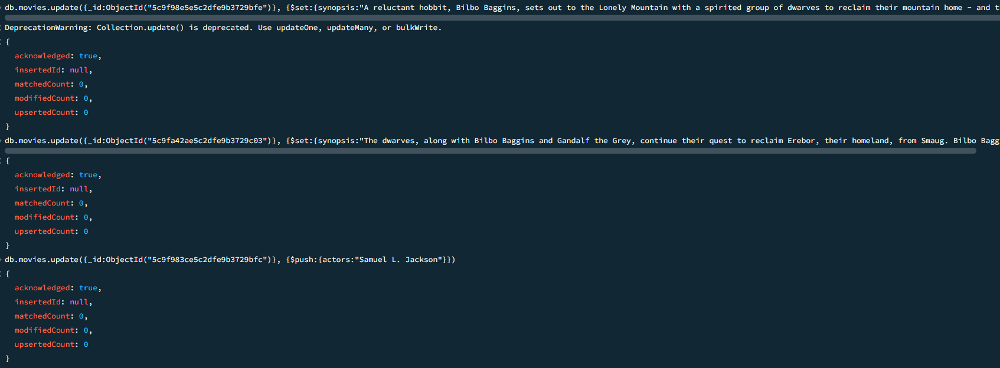

## Text Search

db.movies.find({synopsis:{$regex:"Bilbo"}})

db.movies.find({synopsis:{$regex:"Gandalf"}})

db.movies.find({$and:[{synopsis:{$regex:"Bilbo"}}, {synopsis:{$not:/Gandalf/}}]})

db.movies.find({$or:[{synopsis:{$regex:"dwarves"}}, {synopsis:{$regex:"hobbit"}}]})

db.movies.find({$or:[{synopsis:{$regex:"dwarves"}}, {synopsis:{$regex:"hobbit"}}]})

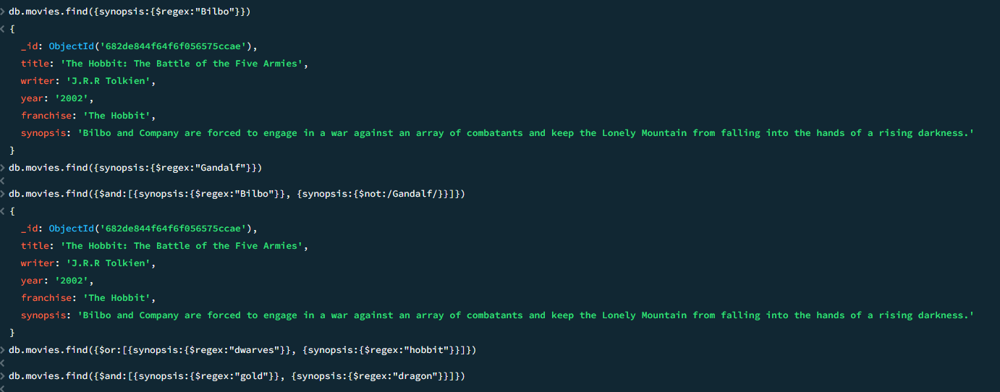

## Delete Documents

db.movies.remove({_id:ObjectId("5c9f992ae5c2dfe9b3729c00")})

db.movies.remove({_id:ObjectId("5c9f9936e5c2dfe9b3729c01")})

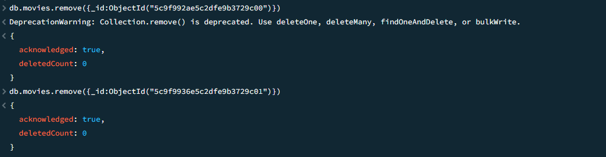

