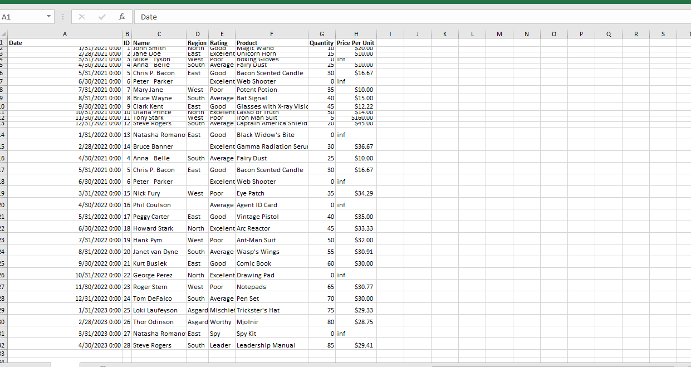
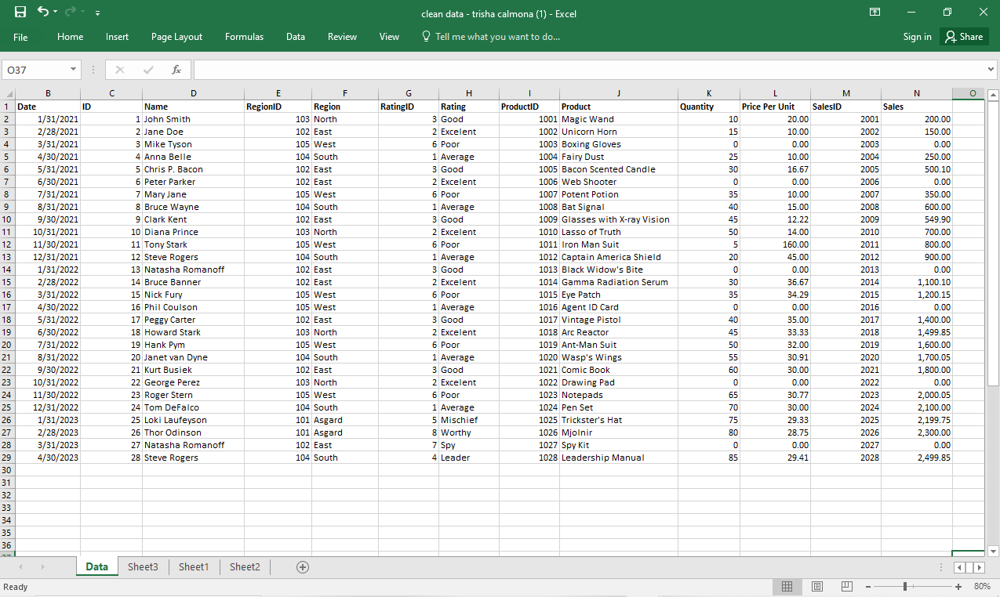
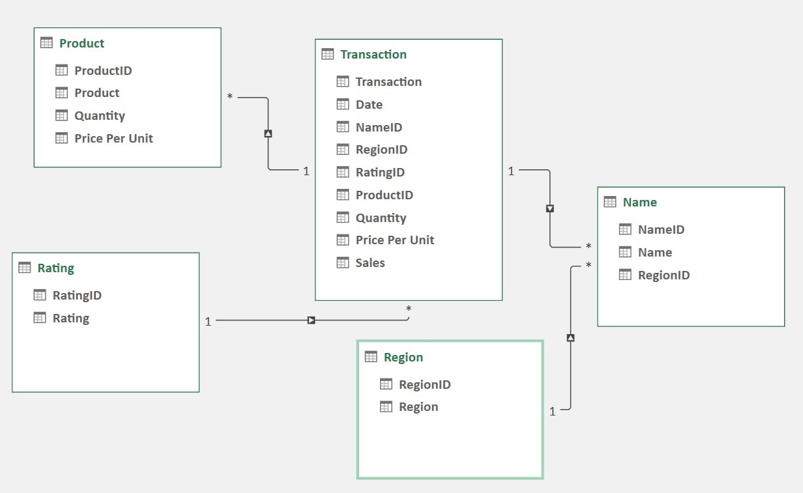

# Midterm Lab Task 1. Data Cleaning and Preparation using Excel
For this task we are given a Flat data from Excel (See rawfile) and we are Task to perform Data Cleaning and Preparation

## Step 1 Data Cleaning process
- Load the raw file
- Fit Column and row width and height
- TRIM extra spaces
- Remove NULL values
- Remove Duplicates
- Spell Check
- Data Validation
- Number Format
  
## Step 2 Normalization
- Perform 1NF
- Perform Table split using 2NF
- Perform 3NF
- Mapped the Normalized tables as a Physical Data Model
  
## Step 3 Here's the screenshoot of my output before I started data cleaning (See screenshot)

## Step 4 Here's the screenshoot of my output after I started data cleaning (See screenshot)

## Here's the Physical Data Model

