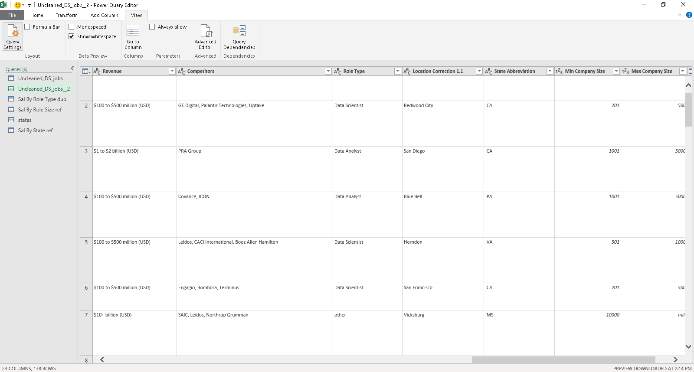
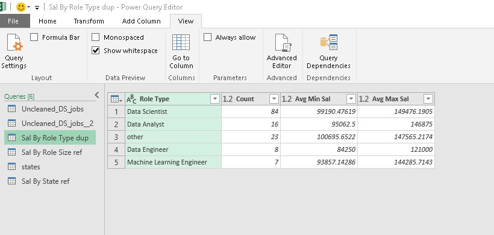
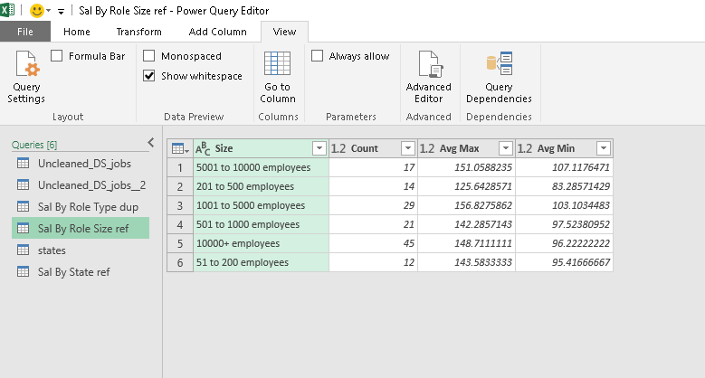
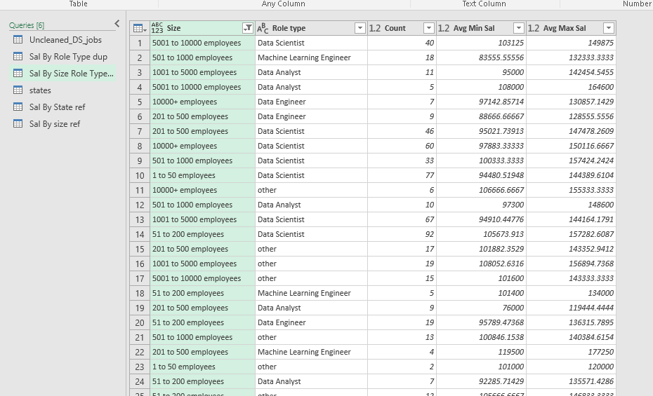
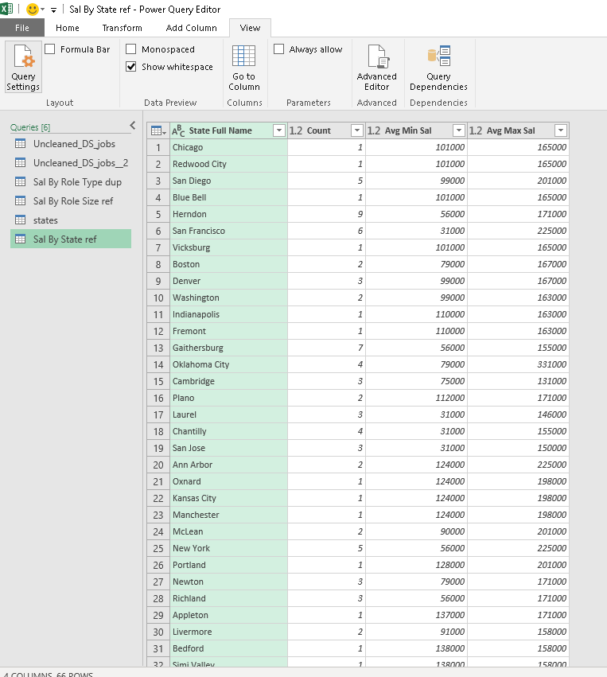
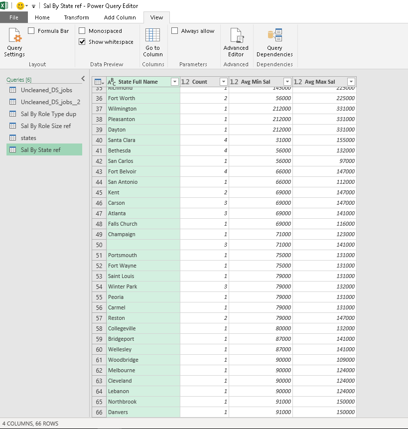
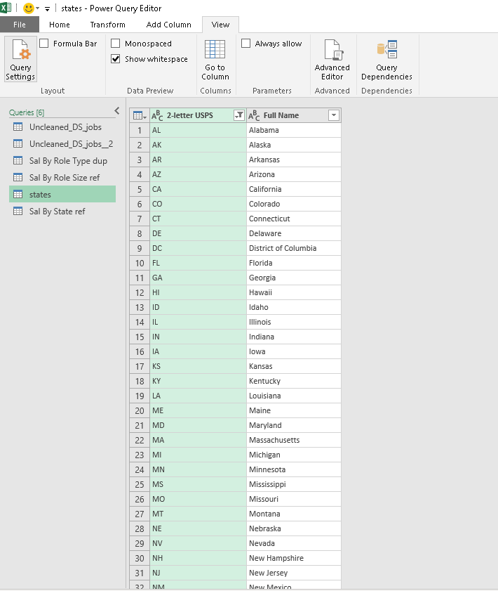
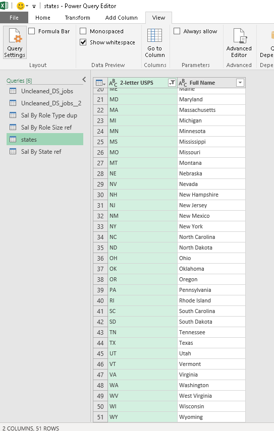
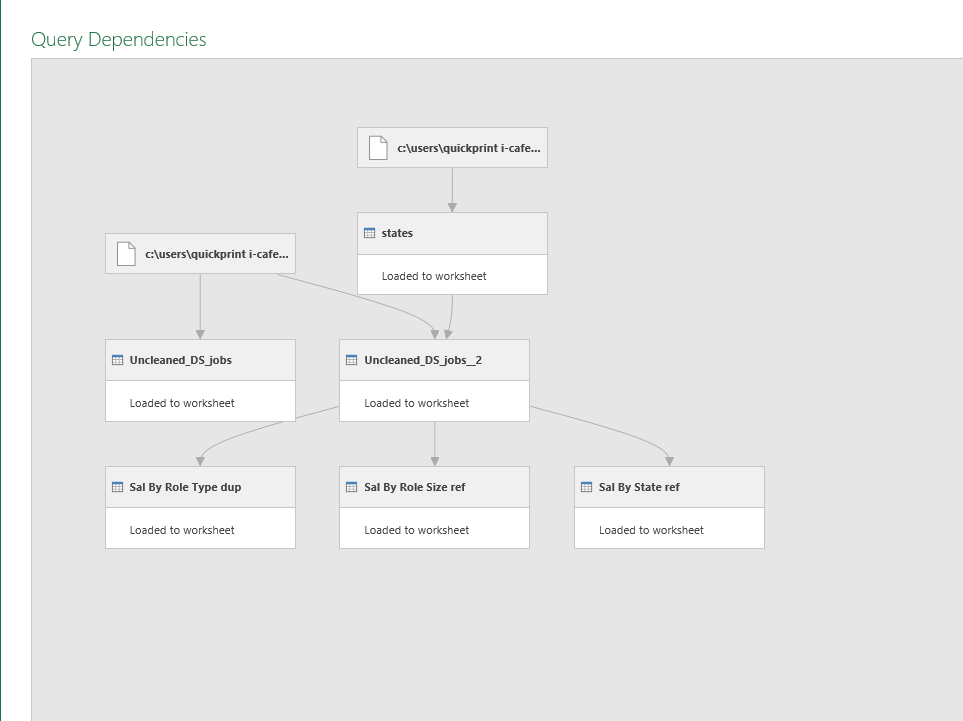

# Midterm Lab Task 2 Data Cleaning and Preparation using Power Query
For this task we are given a Flat data from Excel (See rawfile) and we are Task to perform Data Cleaning and Preparation using Power Query
## Step 1 Data Cleaning Process
- Load the raw file
- Duplicate the raw data
- Salary Estimate Column
- Create 2 New Columns (From the Salary Estimate) Min Sal and Max Sal
- ADD COLUMN – Role Type
- SPLIT COLUMNS by Delimeter
- Select Location column
- Filter New Column
- Handle negative values
## Step 2 Here's the screenshoot of my output before I started data cleaning using power query (See screenshot)

## Step 3 Here's the screenshoot of my output after I started data cleaning using power query (See screenshot)

## Step 4 Here's the screenshot of my group tables using power query (See Screenshot)
- Sal by Role Type

- Sal by Role Size ref

- Sal by Size Role Type

- Sal by State Ref

- States

## Here's the screenshot of my Query Dependencies (See Screenshot) 

